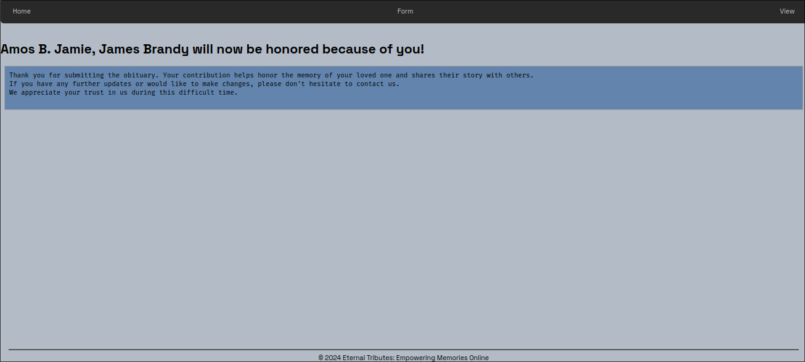

# Empowering Memories Online

Empowering Memories Online is a web application for submitting, managing, and displaying obituaries. It provides a platform to honor and celebrate lives through heartfelt tributes.

## Getting Started

These instructions will get you a copy of the project up and running on your local machine.

### Prerequisites

Make sure you have the following installed:

- Python 3.x

### Installation

1. Clone the repository:

   ```bash
   git clone https://github.com/gekkowrld/obituaries.git
   cd obituaries
   ```

2. Create a virtual environment:

   ```bash
   python -m venv obituaries
   ```

3. Activate the virtual environment:

   - On Windows:

     ```sh
     obituaries\Scripts\activate
     ```

   - On macOS and Linux:

     ```sh
     source obituaries/bin/activate
     ```

4. Install dependencies:

   ```sh
   pip install -r requirements.txt
   ```

### Running the Application

1. Run the Flask application:

   ```sh
   flask run
   ```

2. Open your web browser and go to [http://localhost:5000](http://localhost:5000) to view the application.

## Usage (Navigation)

### Home: Visit [http://localhost:5000](http://localhost:5000) to see the home page.


### Form Access [http://localhost:5000/form](http://localhost:5000/form) to submit a new obituary.

Empty form


Filled form


Succesfull submission



Erroneous submission (only possible with no JS)


### View Obituaries: Navigate to [http://localhost:5000/view](http://localhost:5000/view) to see all submitted obituaries.

The obituaries are displayed 10 per page with page numbers below them.


If you want to view the whole obituary, click the name of the obituary and it will take you to the page.


## Contributing

If you'd like to contribute to this project, please follow these steps:

1. Fork the repository on GitHub.
2. Create a new branch with your feature or bug fix.
3. Commit your changes and push to your branch.
4. Submit a pull request for review.

## License

This project is licensed under the GNU GPLV3 License - see the [LICENSE](LICENSE) file for details.

